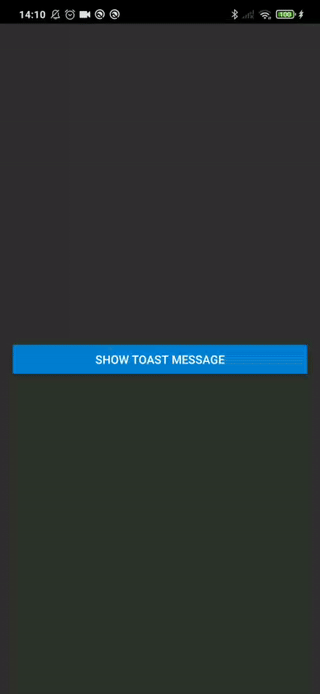

# RTN Toast Message

A simple example for displaying toast messages in a React Native app using TurboModules.

## Demo

**Android:**



**iOS:**


## Installation

### 1. Setup the Example Project

Navigate to the `example` directory:

```sh
cd example
```

### 2. Add the Toast Message Module

Add the rtn-toast-message module to the project:

```sh
yarn add ../rtn-toast-message
```
### 3. Generate Codegen Artifacts for iOS

Run the following command to generate codegen artifacts for iOS:

```sh
cd ..
node example/node_modules/react-native/scripts/generate-codegen-artifacts.js \
  --targetPlatform ios \
  --path example/ \
  --outputPath generated/
```

### 4. Install Dependencies in Example

Return to the example directory and install the toast message module:

```sh
cd example
yarn add ../rtn-toast-message
```

### 5. Install CocoaPods for iOS

If you are working with iOS, install the required CocoaPods dependencies:

```sh
cd ios
RCT_NEW_ARCH_ENABLED=1 pod install
```
### 6. Generate Codegen Artifacts for Android

If you are working with Android, generate the required codegen artifacts:

```sh
cd android
./gradlew generateCodegenArtifactsFromSchema
```

## Usage

```js
import RTNToastMessage from 'rtn-toast-message/js/NativeRTNToastMessage';

const App = () => {
    const showToast = () => {
        RTNToastMessage.showToast('Hello from TurboModule!');
    };

    return (
        <View style={styles.container}>
            <Button title="Show Toast Message" onPress={showToast} />
        </View>
    );
};
```
